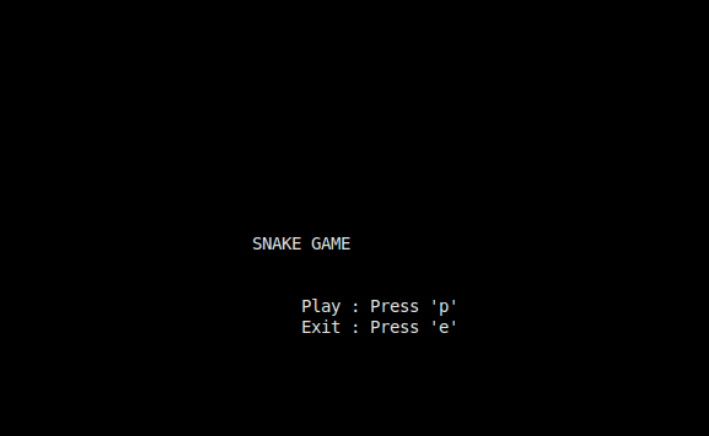
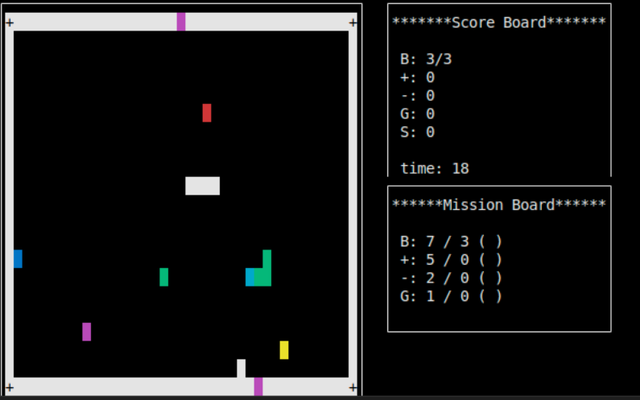
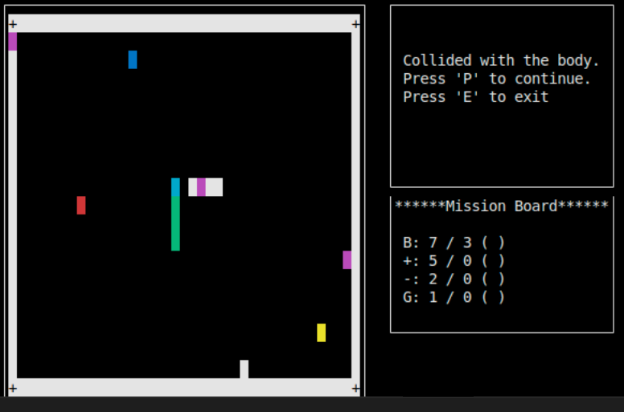
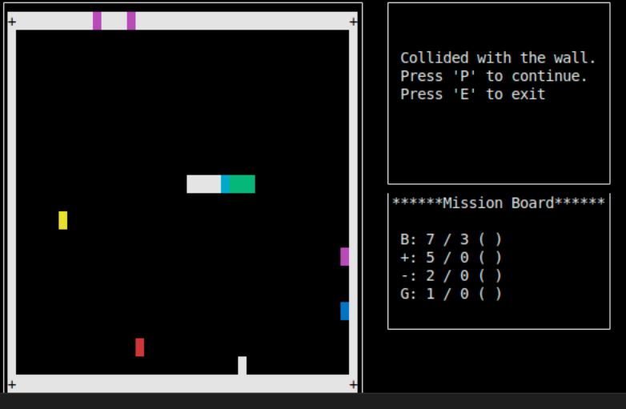
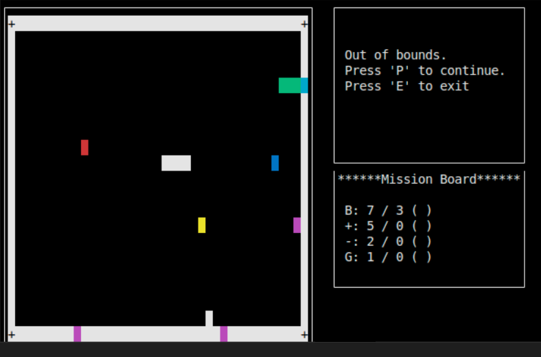

# Snake Game (Team 10, C++ / ncurses)

C++17과 **ncurses** 라이브러리로 구현한 콘솔 Snake Game입니다.  
추가 빌드 스크립트 없이도 한 줄 `g++` 명령으로 실행할 수 있게 구성했습니다.

---

## 목차
1. [파일 구조](#파일-구조)
2. [게임 오브젝트·색상 표](#게임-오브젝트색상-표)
3. [기본 Rules](#기본-rules)
4. [Custom Rules](#custom-rules)
5. [미션 시스템](#미션-시스템)
6. [Game Over 조건](#game-over-조건)
7. [빌드 & 실행](#빌드--실행)
8. [플레이 스크린샷](#플레이-스크린샷)

---

## 파일 구조

```
.
├── README.md          # (현재 파일)
└── src
    ├── block.h        # 게임 오브젝트 기반 클래스 & 상수
    ├── map.h          # 맵·벽·스네이크 초기화, 아이템 스폰
    ├── game.h         # 렌더링·입력·충돌·미션 로직
    └── main.cpp       # 프로그램 진입점
```

---

## 게임 오브젝트·색상 표

| 코드 상수 | 표시 색 | 설명 | 효과 |
|-----------|---------|------|------|
| `Wall`              | **흰색**        | 외곽·내부 벽 | 충돌 → Game Over |
| `ImmunedWall`       | **흰 배경 `+`**     | 네 모서리 면역 벽 | Gate 스폰 불가 |
| `Snake Head`        | **청록**        | 스네이크 머리 | 방향키로 이동 |
| `Snake Body`        | **초록**        | 스네이크 몸통 | 머리와 충돌 불가 |
| `GrowthItem (+)`    | **파랑**        | 몸 +1 | 길이 증가 |
| `PoisonItem (-)`    | **빨강**        | 몸 -1 | 길이 3 미만 → Game Over |
| `TimeItem (T)`      | **노랑**        | 속도 ×1.5 (40 tick) | |
| `ShieldItem (S)`    | **형광 초록**   | 무적 40 tick | 벽·몸 무시<br>맵 밖 이동 **금지** |
| `RandomItem (R)`    | **핑크**        | 위 4종 중 랜덤 효과 | |
| `Gate`              | **자홍**        | 한 쌍 이동 통로 | 규칙 4 참고 |

---

## 기본 Rules
1. **이동**  
   * 방향키 (중복 입력 무시)  
   * 180° 급선회 불가  
   * 벽·몸 충돌 → Game Over
2. **아이템**  
   * 머리가 닿으면 즉시 적용 & 새 위치로 재스폰  
   * 스폰 주기  
     * Growth / Poison : 50 tick  
     * Time : 30 tick
3. **Gate**  
   * 항상 쌍으로 스폰, 겹치지 않음  
   * 통과 중에는 사라지지 않음  
   * 스폰 주기 : 80 tick
4. **Gate 방향 규칙**  
   * 외곽 벽 → 무조건 맵 안쪽  
   * 중앙 벽 → 진입방향 > 시계 > 반시계 > 반대 순
5. **Wall** 충돌 시 Game Over
6. **점수판**  
   * `B` 현재/최대 길이 • `+` Growth • `-` Poison • `G` Gate • `S` Shield  
   * `time` 경과 초

---

## Custom Rules
|            | 내용 |
|------------|------|
| **랜덤 벽** | 길이 4-10 벽 2-6개 |
| **Tick**   | 스테이지마다 50-300 ms |
| **TimeItem** | 속도 1.5× (40 tick) |
| **ShieldItem** | 무적 40 tick (맵 밖 이동 금지) |
| **RandomItem** | 70 tick마다 스폰 • 4종 효과 중 랜덤 |

---

## 미션 시스템
스테이지별 **ALL CLEAR 조건** — 전부 달성 시 다음 스테이지 자동 생성

| 항목 | 달성 기준 |
|------|-----------|
| 길이 (B) | ≥ 7 |
| GrowthItem | ≥ 5 |
| PoisonItem | ≥ 2 |
| Gate 통과 | ≥ 1 |
> ※ Shield / Random 아이템은 미션 집계 제외

---

## Game Over 조건
1. **몸통 충돌** — 머리가 자기 Body와 접촉  
2. **벽 충돌** — `Wall` 또는 `ImmunedWall` 접촉  
3. **맵 밖 이동** — `Shield` 무적 상태라도 맵 좌표를 벗어나면 즉시 Game Over  

---

## 빌드 & 실행
```bash
# (Ubuntu 예시) ncurses 개발 패키지
sudo apt-get install libncurses5-dev

# 컴파일
g++ -std=c++17 src/main.cpp -lncurses -o snake

# 실행
./snake
```

---

## 플레이 스크린샷

| 시작 화면 | 게임 진행 |
|-----------|-----------|
|  |  |

| 몸통 충돌 | 벽 충돌 |
|-----------|-----------|
|  |  |

| 맵 밖 이동 (Shield) |
|--------------------|
|  |

